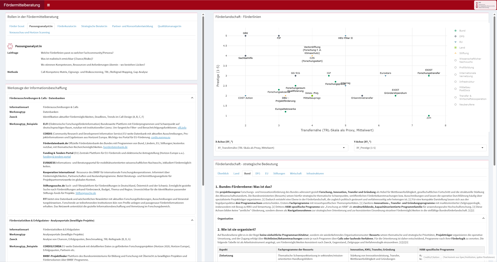

# Research Funding

Tools for **research funding advisory** grounded in a practical advisory model that structures the work of funding advisors into three layers: **roles** (what advisors do), **information tools** (how they obtain and process information), and the **funding landscape** (where programs and funding lines are positioned for strategic matching). 

A key design principle is **portability via a data contract**: tools in this repository read a documented Excel structure as a *single source of truth*. This allows different institutions to adapt, update, and extend the content without changing code—by maintaining their own Excel file (funding lines, metrics, tags, texts). 

---

## Preview



---

## Repository overview

This repository currently includes:

- **Shiny Dashboard (Funding Advisory Tool)**  
  An interactive GUI that loads a multi-sheet Excel workbook and renders:
  - advisory **roles** (tabs)
  - linked **tools** and **examples** (role ? tool ? example)
  - a **funding landscape micro** interactive plot (FMIC)
  - a **funding landscape macro** text view (FMAC) 

- **Standalone “funding landscape” plot script**  
  A reusable interactive plot script to render the micro-level funding landscape from an Excel data contract (useful outside the dashboard as a portable HTML output). 

---

## Purpose and context (non-technical)

### The advisory model (3 layers)
The tool supports advisory conversations by combining:

1. **Roles**: different advisory modes (e.g., scouting, fit analysis, quality support).  
2. **Information tools**: concrete information pathways and routines linked to roles.  
3. **Funding landscape**: an orientation space (macro descriptions + micro plot) to match needs, maturity, and strategy. 

### Excel as a “data contract”
The Excel workbook is the **knowledge base**. You can adapt the dashboard content by editing Excel:
- update texts and descriptions
- add new roles/tools/examples
- add new funding lines and metrics
- manage strategic tags used for interactive filtering in the plot 

> The Excel structure is documented in `docs/documentation.md`.

---

## What you can customize via Excel (no code changes)

Typical customization patterns (examples):
- Add a new **role** row ? a new role tab appears.
- Add new **tools** and link them via **Paths** ? tools become visible for the linked roles.
- Add new **funding lines** (FMIC) ? additional points appear in the plot.
- Add new numeric metric columns starting with **`XY_`** ? metrics become selectable on the X/Y dropdowns.
- Add comma-separated tags in **Strategische_Eignung** ? tags become available for interactive filtering via the plot legend. 

---

## Quick start (for non-technical users)

### 1) Install R and RStudio
- Install **R** (the R language)
- Install **RStudio Desktop** (recommended IDE)

### 2) Download this repository
- Option A: **Download ZIP** from GitHub and unzip it  
- Option B: Clone with Git (optional)

### 3) Open the project in RStudio
Open the file:
- `research-funding.Rproj`

This ensures RStudio uses the repository folder as your project context.

### 4) Run the dashboard
In the RStudio Console:

```r
# (Only once) install renv:
install.packages("renv")

# Restore the package environment defined in renv.lock:
renv::restore()

# Run the Shiny app (from the repository root):
setwd("PATH/TO/research-funding")
shiny::runApp("app")
````

RStudio will print a local URL (e.g., `http://127.0.0.1:...`) and open the dashboard in your browser.

---

## Repository structure

```
research-funding/
  README.md
  LICENSE
  CITATION.cff
  .Rprofile
  research-funding.Rproj
  .gitignore
  renv.lock
  renv/
    activate.R
    settings.json

  docs/
    documentation.md
    screenshots/
      dashboard.png

  app/
    app.R
    data/
      foerder_dashboard.xlsx
    R/
      load_data.R
      validate.R
      transforms.R
      plot_fmic.R
      render_panels.R
    scripts/
      funding-landscape-plot-standalone.R
    www/
      styles.css
      logo.png
      Fernrohr.png
      role_icons/...
```

---

## Dependencies

This project uses **renv** for reproducible dependency management.

- `renv.lock` defines exact package versions.
    
- `renv::restore()` installs the required libraries on a new machine.
    

---

## Citation

If you use this repository, please see [`CITATION.cff`](CITATION.cff) for citation information.

---

## License
Source code is licensed under MIT, documentation under CC-BY 4.0.  
See [LICENSE](LICENSE) for details.
